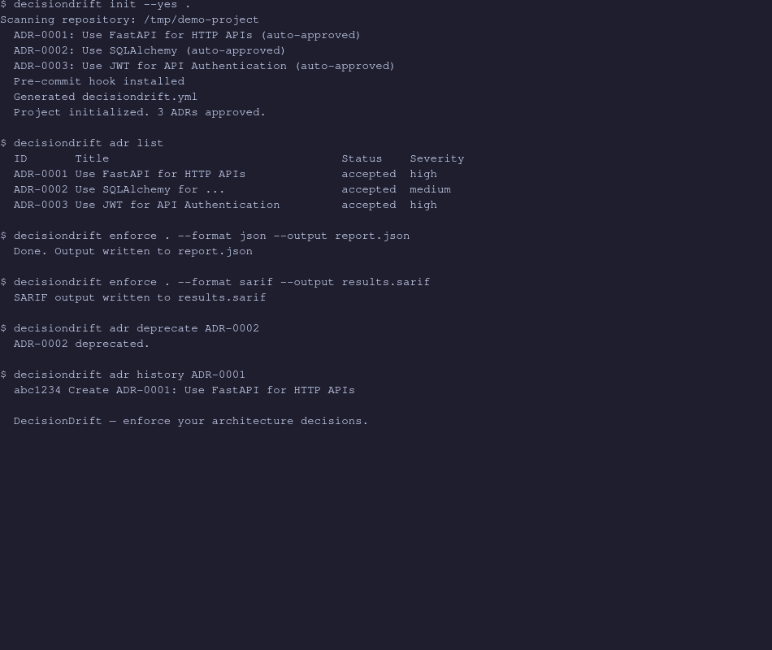

# DecisionDrift

[](https://pypi.org/project/decisiondrift/)
[](https://pypi.org/project/decisiondrift/)
[](https://github.com/madhan-karthikeyan/DecisionDrift/actions/workflows/ci.yml)
[](https://github.com/madhan-karthikeyan/DecisionDrift/blob/main/LICENSE)

**Your team's architecture decisions, enforced automatically.** Every time someone pushes code, DecisionDrift checks it against your documented decisions — without needing an LLM for the critical path.



## What is this?

Engineering teams make decisions all the time: *"Use FastAPI, not Flask"*, *"Only PostgreSQL for storage"*, *"All APIs must use JWT auth"*. These decisions live in documents (ADRs), but nobody checks them against every PR.

DecisionDrift closes that gap. It turns your decisions into automated rules, runs them on every change, and catches violations before they ship. No LLM needed for enforcement — just deterministic rule matching.

## Quick start

```bash
pip install decisiondrift
cd my-project
decisiondrift init .
```

That's it. `init` scans your repo, proposes decisions to codify, installs a pre-commit hook, and generates a config file. Approve relevant decisions and you're covered.

```bash
# Check your current changes against approved decisions
decisiondrift enforce --from-git
```

## How it works

1. **Document decisions** as ADR files (or generate them from your repo with `decisiondrift bootstrap`)
2. **Approve** the ones that reflect real team decisions
3. **Every commit/PR** gets checked automatically — deterministic rules catch prohibited dependencies, imports, APIs, and file patterns
4. **Problems surface** as CLI output, JSON/SARIF reports, GitHub Action comments, or pre-commit blocks

## When you'd use this

| Situation | How DecisionDrift helps |
|-----------|------------------------|
| A PR adds a prohibited dependency | Blocks with a clear error: "ADR-0001 prohibits fastapi" |
| An old decision is outdated | `adr supersede` creates a replacement, marks the old one as superseded |
| Onboarding a new team member | `adr list` shows every documented decision, `adr show` explains why |
| CI needs governance checks | `--format sarif` integrates with GitHub code scanning |
| A decision needs updating | `adr edit` opens it in your editor, `adr history` shows the change log |
| You want one-command setup | `decisiondrift init .` bootstraps, approves, hooks, configures everything |

## Workflow
<pre>
                      ┌──────────────┐
                    │ decisiondrift│
                    │     init     │
                    └──────┬───────┘
                           │
         ┌─────────────────┴─────────────────┐
         │                                   │
         ▼                                   ▼
  bootstrap                           guard --install
         │                                   │
         ▼                                   ▼
 Generate ADRs                     Install Git Hook
         │                                   │
         ▼                                   │
Human approves/rejects                       │
         │                                   │
         ▼                                   │
 Accepted ADRs ◄─────────────────────────────┘
         │
         ▼
 Rule Generator
         │
         ▼
     enforce
         │
 ┌───────┴────────┐
 │                │
 ▼                ▼
git commit     GitHub Action
 │                │
 ▼                ▼
Pass/Fail     Pass/Fail + PR Comment
                  │
                  ▼
           Branch Protection
                  │
                  ▼
            Merge Allowed/Blocked

Separate utilities:
────────────────────────────────────────
review  → semantic LLM analysis
audit   → repository health
impact  → changed ADR analysis
doctor  → diagnostics
ingest  → ADR generation from documents
adr     → ADR lifecycle management
</pre>

## Where to go next

| Resource | What you'll find |
|----------|-----------------|
| [`docs/quickstart.md`](docs/quickstart.md) | Step-by-step walkthrough with examples |
| [`docs/cli-reference.md`](docs/cli-reference.md) | Every command, flag, and exit code |
| [`docs/faq.md`](docs/faq.md) | Common questions answered |
| [`docs/architecture.md`](docs/architecture.md) | System design and data flow |
| [`docs/evaluation.md`](docs/evaluation.md) | Retrieval and classification accuracy |

## VS Code Extension

Real-time architecture feedback in your editor. Install from the `.vsix`:

```bash
code --install-extension extensions/vscode-decisiondrift/vscode-decisiondrift-0.1.0.vsix
```

Requires `decisiondrift` on `PATH` (`pip install decisiondrift`). Analyzes files on save/open, shows violations as editor diagnostics, and surfaces findings in the sidebar.

## Examples

**One-command project setup:**
```bash
decisiondrift init --with-ci --yes .
# → Bootstraps ADRs, approves all, installs pre-commit hook,
#   generates decisiondrift.yml + GitHub Actions workflow
```

**JSON output for tooling:**
```bash
decisiondrift enforce . --format json --output report.json
```

**CI integration:**
```yaml
# .github/workflows/decisiondrift.yml
- uses: madhan-karthikeyan/DecisionDrift@v1
  with:
    github-token: ${{ secrets.GITHUB_TOKEN }}
```

**Lifecycle management:**
```bash
decisiondrift adr review .       # Review and approve/reject candidates
decisiondrift adr deprecate ADR-0002   # Mark as deprecated
decisiondrift adr supersede ADR-0001 "Use FastAPI"  # Replace with new
```

## Key facts

- **No LLM required** for enforcement — 5 rule types (dependency, import, API, path, config) run deterministically
- **Multi-language** — Python AST built-in; JS, TS, Go, Java, Rust via `pip install decisiondrift[ast]`
- **Custom rules** — define additional checks in `decisiondrift.yml` without creating an ADR
- **GitHub Action** — posts PR comments, sets commit status, submits reviews, generates SARIF
- **363 tests** passing, 26 skipped (tree-sitter optional dep)

## License

MIT

---

*Built to make sure every architecture decision your team makes is actually followed.*
