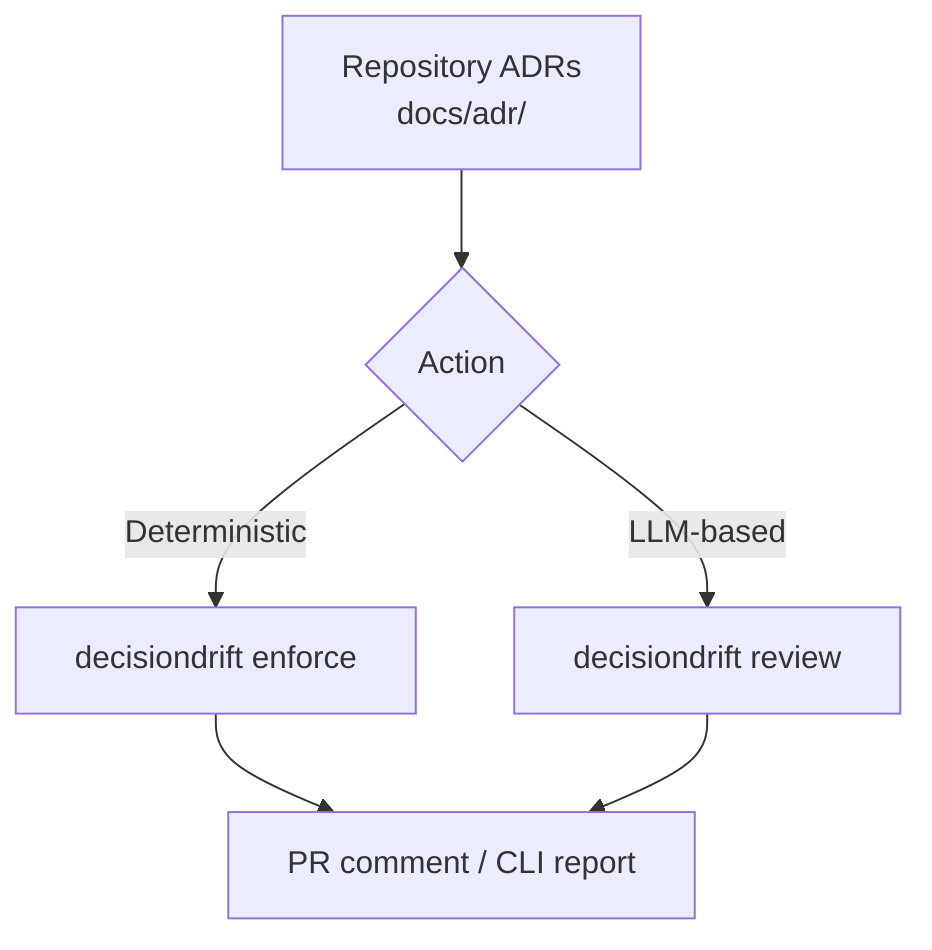

# DecisionDrift

[](https://pypi.org/project/decisiondrift/)
[](https://pypi.org/project/decisiondrift/)
[](https://github.com/madhan-karthikeyan/DecisionDrift/actions/workflows/ci.yml)
[](https://github.com/madhan-karthikeyan/DecisionDrift/blob/main/LICENSE)
[](https://github.com/astral-sh/ruff)

**Deterministic-first decision governance.** Codify architecture decisions as enforceable rules, detect drift before it reaches production, and keep your codebase aligned with documented decisions.




## How It Works

1. **Bootstrap** scans your repository structure, detects technologies and patterns, and proposes candidate ADRs (Architecture Decision Records).
2. **You approve** the ADRs that reflect real team decisions. Each ADR can express prohibitions (e.g., "don't add Flask alongside FastAPI").
3. **The deterministic rule engine (`enforce`)** converts accepted ADRs into dependency, import, path, API, and config rules — with zero LLM cost.
4. **On every change**, `enforce` checks the diff or full repo against active rules. Detected violations exit non-zero, suitable for CI gating.
5. **The LLM classifier (`review`)** optionally provides semantic analysis for complex cases beyond simple rule matching.
6. **Audit** periodically checks ADR health: drift detection, stale/expired ADRs, quality scores, and coverage gaps.

### Example

Given this ADR:

```yaml
id: ADR-0001
title: Use Flask as Web Framework
status: accepted
prohibitions: [fastapi, django]
```

The rule engine generates two rules:
- **Dependency rule**: BLOCK if `fastapi` or `django` appears in dependency files
- **Import rule**: BLOCK if `fastapi` or `django` is imported anywhere

Running `decisiondrift enforce` against a diff that adds `fastapi` to `requirements.txt`:

```
  [BLOCK] ADR-0001 (dependency)
           Match: fastapi
           File: requirements.txt
```

---

## Quickstart

### 1. Install

```bash
pip install decisiondrift
```

Or from source:

```bash
git clone https://github.com/yourorg/decisiondrift
cd decisiondrift
pip install -e .
```

### 2. Bootstrap ADRs from your repo structure

```bash
# Scan the repo and propose candidate ADRs (dry-run by default)
decisiondrift bootstrap .

# Review what was generated
decisiondrift adr list --status proposed

# Approve the ones that reflect real team decisions
decisiondrift adr approve ADR-0001
```

### 3. Enforce rules against a diff or full repo

```bash
# Check unstaged changes against accepted ADRs
decisiondrift enforce --from-git

# Full repository scan (for CI or audit)
decisiondrift enforce .

# Fail CI on any rule violation (not just BLOCK-level)
decisiondrift enforce --from-git --fail-on warn
```

### 4. Run an ADR health audit

```bash
decisiondrift audit
```

Shows expired/stale ADRs, drift detection (rules violated by current codebase), technology coverage gaps, and ADR quality scores.

### 5. Install as a pre-commit hook

```bash
decisiondrift guard --install
```

This installs a hook that runs `decisiondrift enforce --from-git` before every commit.

### 6. Run an LLM-based review (optional)

```bash
# Requires DECISIONDRIFT_LLM_API_KEY
decisiondrift review --from-git
```

### 7. Ingest decisions from free-text notes

```bash
decisiondrift ingest meeting-notes.md
```

Extracts candidate decisions from RFCs, meeting notes, or chat transcripts.

---

## CLI Reference

| Command | Description |
|---------|-------------|
| `decisiondrift bootstrap <path>` | Generate candidate ADRs from repository structure (V3 deterministic) |
| `decisiondrift enforce [diff]` | Enforce ADR rules against a diff or full repo (exit code: violations) |
| `decisiondrift audit` | ADR health audit: drift, stale/expired, quality, coverage |
| `decisiondrift review [diff]` | LLM-based semantic violation classification |
| `decisiondrift impact [diff]` | Analyze diff for impacted symbols (AST-based diagnostic) |
| `decisiondrift ingest <file>` | Extract candidate ADRs from free-text notes (LLM required) |
| `decisiondrift adr list` | List ADRs (filter by `--status`, `--source`) |
| `decisiondrift adr approve ADR-XXXX` | Approve a proposed ADR |
| `decisiondrift adr reject ADR-XXXX` | Reject a proposed ADR |
| `decisiondrift guard` | Pre-commit hook runner (`--install` to set up) |

### Key Options

| Option | Applies To | Description |
|--------|-----------|-------------|
| `--from-git` | enforce, review, impact | Read diff from `git diff` |
| `--fail-on [level]` | enforce | Minimum severity that causes non-zero exit (block, require_approval, warn, info) |
| `--dry-run` / `--apply` | bootstrap | Preview candidates or write them to disk |
| `--min-confidence` | bootstrap | Minimum evidence level for candidates |
| `--repo <path>` | enforce, review, audit, impact | Repository root (default: `.`) |
| `--adr-dir <path>` | All ADR commands | ADR directory (default: `docs/adr`) |

---

## ADR Lifecycle

| Status | Meaning | Enforced? |
|--------|---------|-----------|
| `proposed` | Generated but unreviewed | No |
| `accepted` | Approved by a maintainer | **Yes** |
| `rejected` | Declined; kept for dedup | No |
| `deprecated` | No longer valid | No |
| `superseded` | Replaced by a newer ADR | No |

Only `accepted` ADRs participate in enforcement. Generated candidates can never silently block a PR.

---

## Deterministic Rule Engine

The rule engine (`decisiondrift enforce`) is the core of DecisionDrift's governance model. It operates without any LLM dependency:

- **Dependency rules**: Check `requirements.txt`, `pyproject.toml`, `package.json`, `go.mod`, `Cargo.toml` for prohibited packages
- **Import rules**: Scan Python AST for prohibited imports
- **Path rules**: Regex-match file paths against patterns
- **API rules**: Detect prohibited function/method calls in Python files
- **Config rules**: Scan config files (YAML, JSON, TOML, INI) for matching key-value patterns

Rules are generated automatically from ADR `prohibitions` field. Confidence levels (high/medium/low) control enforcement severity: low-confidence rules downgrade BLOCK to INFO.

---

## LLM Configuration (Optional)

For the `review` and `ingest` commands, set via environment variables or `decisiondrift.yml`:

```env
DECISIONDRIFT_LLM_API_KEY=sk-...
DECISIONDRIFT_LLM_MODEL=gpt-4o
DECISIONDRIFT_LLM_BASE_URL=https://api.openai.com/v1
```

Without an API key, `review` falls back to non-functional output and `enforce` (deterministic) is recommended instead.

---

## GitHub Action

Add `.github/workflows/decisiondrift.yml`:

```yaml
name: DecisionDrift
on: pull_request
permissions:
  pull-requests: write
  contents: read
jobs:
  review:
    runs-on: ubuntu-latest
    steps:
      - uses: actions/checkout@v4
      - uses: yourorg/decisiondrift@v1
        with:
          llm-api-key: ${{ secrets.DECISIONDRIFT_LLM_KEY }}
```

---

## Project Structure

```
src/decisiondrift/
  cli.py                     # CLI entrypoint (Click)
  config.py                  # Config loader (YAML + .env)
  models/schema.py           # Pydantic models
  adr/                       # ADR loader, parser, writer, supersession
  adr_manager/               # adr list/approve/reject commands
  bootstrap/                 # V3 structure scanner + candidate generation
  rules/                     # Deterministic rule engine (5 rule types)
  classification/            # LLM classifier
  github/                    # GitHub Action adapter
  impact/                    # Diff parser + AST extraction (Python + Tree-sitter)
  ingest/                    # Free-text → ADR pipeline
  report/                    # Text + GitHub comment formatters
  retrieval/                 # Keyword-based ADR retrieval
  review/                    # Orchestrator pipeline
```

---

## Evaluation

| Metric | Score |
|--------|-------|
| Retrieval Recall@5 | **95.2%** (20/21 patches) |
| Retrieval Recall@1 | **85.7%** (18/21 patches) |
| Classification | Requires LLM API key; see `docs/evaluation.md` |

Tested against 21 labeled patches (13 violations, 8 non-violations) across 12 architecture decisions.

---

## Limitations

- **Python-focused AST analysis.** Tree-sitter support exists for JS, TS, Go, Java, Rust but requires `pip install decisiondrift[ast]`. Non-Python files in the rule engine still work for dependency and path rules.
- **Keyword-only retrieval.** May miss ADRs when symbol/file-path terms don't match (embedding-based hybrid retrieval in `[embeddings]` extras).
- **Ollama CPU-bound on large models.** ~17s/pair with qwen2.5-coder:7b; use Groq/OpenAI for ~1s latency.
- **Bootstrap is heuristic.** Directory-naming detection is not architectural understanding — generated ADRs require human approval.

---

## Development

```bash
pip install -e ".[embeddings,ast]"
python -m pytest tests/
```

See `docs/plan.md` for the full design document and `docs/progress.md` for current status.
