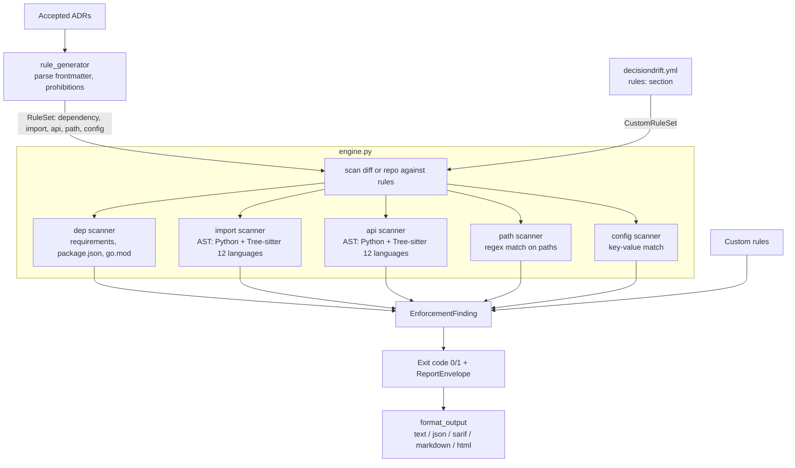
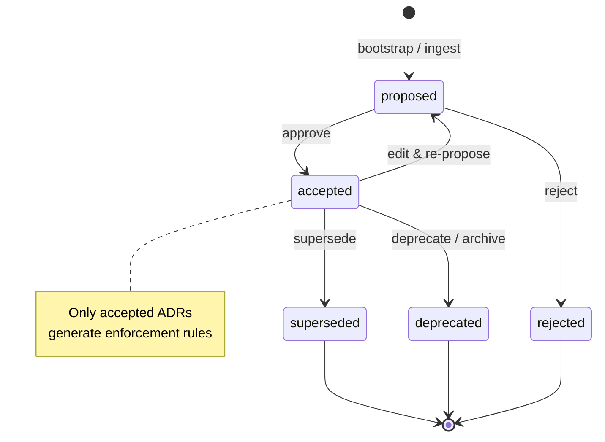
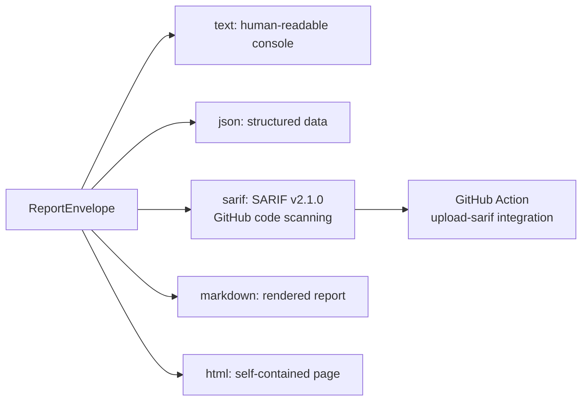

# Architecture

## CLI Flow

```mermaid
graph TD
    CLI[decisiondrift command] --> B[bootstrap path]
    CLI --> E[enforce diff/.]
    CLI --> A[audit]
    CLI --> R[review diff]
    CLI --> I[ingest file]
    CLI --> L[adr list/approve/reject/deprecate/supersede/edit/history/review]
    CLI --> G[guard --install]
    CLI --> INIT[init path]

    B --> |Deterministic - no LLM| S[scan_repo]
    S --> SS[structure_scan.py<br>dirs, files, indicators]
    S --> D[detectors.py<br>technologies, frameworks]
    S --> P[patterns.py<br>pattern matching]
    S --> CG[candidate_generator.py<br>ADRSuggestion]

    E --> |Deterministic - no LLM| EN[engine.py]
    EN --> SD[scan_dependencies<br>5 dep file types]
    EN --> SI[scan_imports<br>Python AST + Tree-sitter: 12 languages]
    EN --> SA[scan_api_calls<br>Python AST + Tree-sitter: 12 languages]
    EN --> SP[scan_paths<br>regex]
    EN --> SC[scan_config<br>YAML/JSON/TOML/INI]
    EN --> CR[custom_rules<br>decisiondrift.yml rules section]

    A --> |Deterministic - no LLM| AM[adr_manager]
    AM --> CD[check_drift]
    AM --> CE[check_expiry]
    AM --> QS[quality_score]

    R --> |Optional LLM| CL[classification/classifier.py]
    CL --> RA[retrieve_adrs<br>keyword/embedding]
    CL --> LC[llm_classify<br>pairwise]

    I --> |LLM required| SEG[segmenter]
    SEG --> LLM[LLM extraction]
    LLM --> ADR[Generated ADR]

    G --> |Deterministic| PRE[pre-commit hook]
    PRE --> ENF[enforce --from-git]

    INIT --> B
    INIT --> INT_REVIEW[interactive approve/reject]
    INIT --> HOOK_INS[pre-commit install]
    INIT --> GEN_CFG[generate decisiondrift.yml]
    INIT --> GEN_CI[generate GitHub Actions workflow]
```



## Bootstrap Pipeline (V3)

```mermaid
graph TD
    RT[Repository Tree] --> CE[collect_evidence<br>deps, imports, files, dirs]

    subgraph Registry Layer
    R[TechnologyRegistry<br>default_registry.yaml<br>schema: 1] --> LK[Layered Lookup]
    HTTP[Remote HTTP Registries<br>--registry-url / config] --> LK
    GC[Global Cache<br>~/.config/decisiondrift/cache.yaml] --> LK
        PC[Project Cache<br>.decisiondrift/cache.yaml] --> LK
    end

    CE --> |Evidence[]| BT[build_technology_candidates]
    LK --> BT
    BT --> |TechnologyCandidate| IT[infer_repository_role]
    IT --> RC[apply_repository_context]
    RC --> DC[discover_governance_candidates]
    LK --> DC

    subgraph LLM Path (optional --llm)
        KP[KnowledgeProvider]
        KP --> |LLMClient| LLM[GPT / Ollama / Groq]
        LLM --> |JSON validation + retry| RS[RecognitionResult]
        RS --> |composite confidence| KP
        KP --> BT
        KP --> DC
    end

    DC --> |GovernanceDecisionCandidate| AE[analyze_enforceability]
    AE --> |EnforceabilityAnalysis| GS[generate_v3_suggestions]
    GS --> |ADRSuggestion| TG[template_gen<br>render ADR markdown]
```

## Rule Engine



## ADR Lifecycle



## Output Formats


