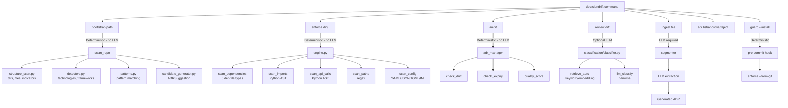
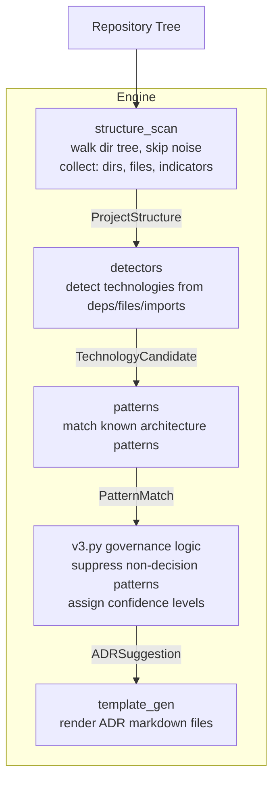
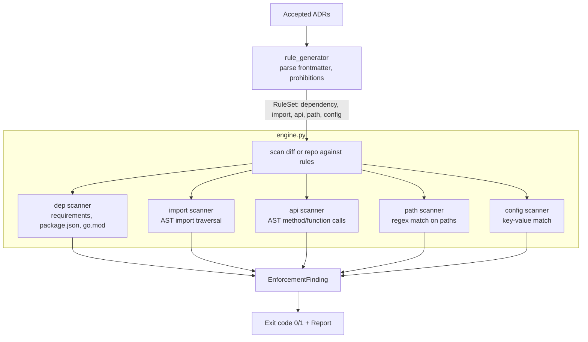
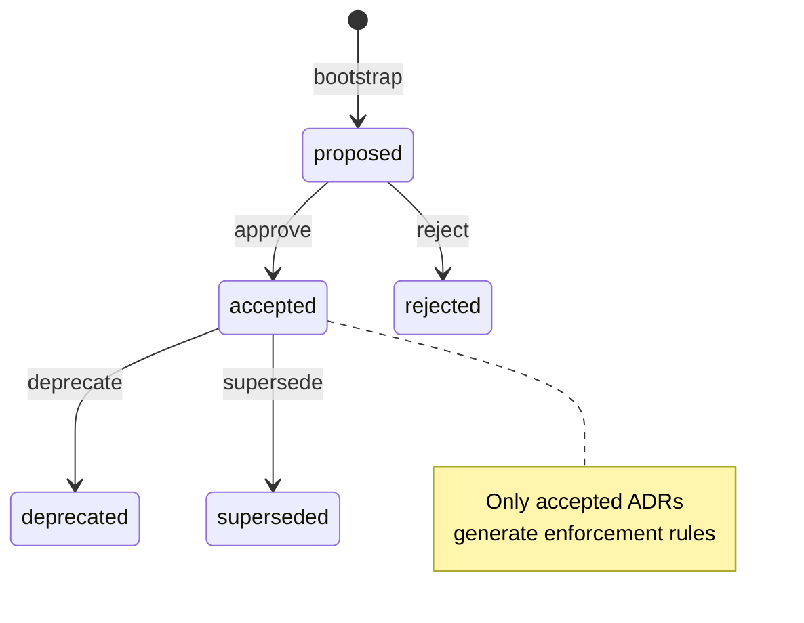

# Architecture

## CLI Flow

```mermaid
graph TD
    CLI[decisiondrift command] --> B[bootstrap path]
    CLI --> E[enforce diff/.]
    CLI --> A[audit]
    CLI --> R[review diff]
    CLI --> I[ingest file]
    CLI --> L[adr list/approve/reject]
    CLI --> G[guard --install]

    B --> |Deterministic - no LLM| S[scan_repo]
    S --> SS[structure_scan.py<br>dirs, files, indicators]
    S --> D[detectors.py<br>technologies, frameworks]
    S --> P[patterns.py<br>pattern matching]
    S --> CG[candidate_generator.py<br>ADRSuggestion]

    E --> |Deterministic - no LLM| EN[engine.py]
    EN --> SD[scan_dependencies<br>5 dep file types]
    EN --> SI[scan_imports<br>Python AST]
    EN --> SA[scan_api_calls<br>Python AST]
    EN --> SP[scan_paths<br>regex]
    EN --> SC[scan_config<br>YAML/JSON/TOML/INI]

    A --> |Deterministic - no LLM| AM[adr_manager]
    AM --> CD[check_drift]
    AM --> CE[check_expiry]
    AM --> QS[quality_score]

    R --> |Optional LLM| CL[classification/classifier.py]
    CL --> RA[retrieve_adrs<br>keyword/embedding]
    CL --> LC[llm_classify<br>pairwise]

    I --> |LLM required| SEG[segmenter]
    SEG --> LLM[LLM extraction]
    LLM --> ADR[Generated ADR]

    G --> |Deterministic| PRE[pre-commit hook]
    PRE --> ENF[enforce --from-git]
```

## Bootstrap Pipeline (V3)

```mermaid
graph TD
    RT[Repository Tree] --> SS
    
    subgraph Engine
        SS[structure_scan<br>walk dir tree, skip noise<br>collect: dirs, files, indicators] --> |ProjectStructure| D
        D[detectors<br>detect technologies from deps/files/imports] --> |TechnologyCandidate| P
        P[patterns<br>match known architecture patterns] --> |PatternMatch| V[v3.py governance logic<br>suppress non-decision patterns<br>assign confidence levels]
        V --> |ADRSuggestion| T[template_gen<br>render ADR markdown files]
    end
```

## Rule Engine

```mermaid
graph TD
    A[Accepted ADRs] --> RG
    
    RG[rule_generator<br>parse frontmatter, prohibitions] --> |RuleSet: dependency, import, api, path, config| E
    
    subgraph engine.py
        E[scan diff or repo against rules]
        E --> D[dep scanner<br>requirements, package.json, go.mod]
        E --> I[import scanner<br>AST import traversal]
        E --> API[api scanner<br>AST method/function calls]
        E --> P[path scanner<br>regex match on paths]
        E --> C[config scanner<br>key-value match]
    end
    
    D --> F[EnforcementFinding]
    I --> F
    API --> F
    P --> F
    C --> F
    
    F --> X[Exit code 0/1 + Report]
```

## ADR Lifecycle

```mermaid
stateDiagram-v2
    [*] --> proposed: bootstrap
    proposed --> accepted: approve
    proposed --> rejected: reject
    accepted --> deprecated: deprecate
    accepted --> superseded: supersede
    
    note right of accepted: Only accepted ADRs<br>generate enforcement rules
```
